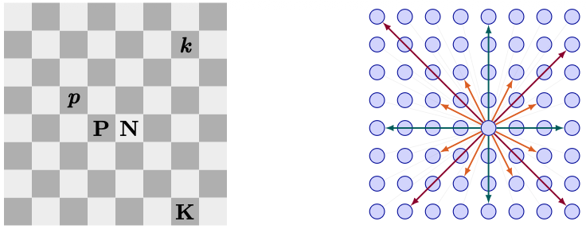

# chess-gnn

<!--  -->
<p align="center">
  
</p>

A message-passing graph neural network that plays chess. A board is encoded as a fully-connected 64-node graph (nodes = squares, features = piece type + position + global state); the network outputs one logit per directed (from, to) edge, which (after legal-move masking and temperature-scaled softmax) gives a distribution over legal moves. Optional PUCT MCTS wraps the policy/value heads at inference and during self-play RL.

## Quickstart

```bash
git clone https://github.com/jordanshivers/chess-gnn.git && cd chess-gnn
python -m venv .venv && source .venv/bin/activate
pip install -e ".[viz,web,dev]"
python -m pytest                                     # sanity check
# train a tiny SL model
jupyter notebook notebooks/train_sl.ipynb
```

## Layout

```
src/chess_gnn/
  encoding.py      board -> PyG Data (node + edge features)
  moves.py         legal-move masking, index <-> UCI decoding
  model.py         ChessGNN (TransformerConv trunk + policy/under-promo/value heads)
  dataset.py       streaming PGN iterable dataset (supports .pgn.zst)
  train_sl.py      supervised pre-training on PGN data
  selfplay.py      self-play game generation (raw-policy and MCTS-driven)
  mcts.py          PUCT Monte-Carlo Tree Search over policy/value heads
  train_rl.py      RL fine-tuning: AlphaZero-style distillation or PPO
  eval_elo.py      Elo estimation via calibrated Stockfish matches
  play.py          GNNAgent: temperature sampling + optional MCTS
  viz.py           SVG board rendering with predicted-move arrows
app/gradio_app.py  Gradio inspection UI (FEN editor, arrows, sample/play/undo)
app/gradio_play.py Gradio play-a-full-game UI
app/web_play.py    drag-and-drop Flask + chessboard.js UI (offline-capable)
notebooks/
  train_sl.ipynb   supervised training (local or Colab)
  train_rl.ipynb   RL fine-tuning (local or Colab)
  eval_elo.ipynb   Elo estimation via Stockfish ladder (local or Colab)
tests/             pytest suite
```

## Setup (local)

```bash
python -m venv .venv
source .venv/bin/activate
pip install -e ".[viz,web,dev]"
python -m pytest
```

Extras:


| Extra | Installs                            | Needed for                            |
| ----- | ----------------------------------- | ------------------------------------- |
| `viz` | matplotlib, gradio, jupyter, Pillow | notebooks, Gradio apps, GIF rendering |
| `web` | flask                               | `app/web_play.py` drag-and-drop UI    |
| `dev` | pytest, ruff                        | test suite / linting                  |


PyTorch Geometric wheels must match your Torch version. For CPU/MPS on Apple Silicon the command above works as-is; for CUDA machines, see [https://pytorch-geometric.readthedocs.io/en/latest/install/installation.html](https://pytorch-geometric.readthedocs.io/en/latest/install/installation.html).

## Workflow

The recommended path is **supervised pre-training on Lichess → RL self-play fine-tune**. Self-play from scratch in chess is extremely slow; bootstrapping from SL gives the RL phase a meaningful gradient signal.

### 1. Supervised pre-training

**Data.** Download a PGN dump from [Lichess database](https://database.lichess.org/) (monthly standard dumps, or the Elite subset for stronger play) into `data/`. The dataset class reads `.pgn` and `.pgn.zst` directly - no decompression needed.

```bash
mkdir -p data
# pick any month from https://database.lichess.org/#standard_games
curl -L -o data/lichess.pgn.zst \
    https://database.lichess.org/standard/lichess_db_standard_rated_2013-01.pgn.zst
```

**Train.**

```bash
python -m chess_gnn.train_sl \
    --pgn data/lichess_elite.pgn.zst \
    --ckpt checkpoints/sl \
    --steps 100000 \
    --batch-size 256 \
    --value-coef 0.25 \
    --min-elo 2200 \
    --device cpu                  # or: mps, cuda
```

Checkpoints are written to `checkpoints/sl/sl_step{N}.pt` and `sl_final.pt`. Top-1 / top-5 move-match accuracy and value loss on the streamed batch are logged every `--log-every` steps. The supervised dataset also trains the value head from each game's final result, signed from the side-to-move's perspective; this is important because MCTS uses the value head to evaluate leaves.

**Or use the notebook** (runs locally or on Colab): [notebooks/train_sl.ipynb](notebooks/train_sl.ipynb).

### 2. RL fine-tuning

Requires an SL checkpoint to start from.

Two objectives are available:

- **`--algo az` (default)** - AlphaZero-style. Each self-play move runs PUCT MCTS with root Dirichlet noise for exploration, and the visit distribution is used as a dense per-move policy target (cross-entropy). Works even when self-play games draw.
- **`--algo ppo`** - PPO with a clipped-ratio surrogate and the value head as baseline. Reuses each rollout across multiple epochs. No MCTS during self-play, so it's much faster per game but relies on decisive outcomes.

```bash
# AlphaZero-style (default)
python -m chess_gnn.train_rl \
    --sl-ckpt checkpoints/sl/sl_final.pt \
    --ckpt checkpoints/rl \
    --iterations 200 \
    --games-per-iter 16 \
    --mcts-sims 64 \
    --device cpu                  # or: mps, cuda

# PPO
python -m chess_gnn.train_rl \
    --sl-ckpt checkpoints/sl/sl_final.pt \
    --ckpt checkpoints/rl \
    --algo ppo --ppo-clip 0.2 \
    --iterations 200 --games-per-iter 16 --epochs-per-iter 4 \
    --temperature 0.7
```

Every `--eval-every` iterations, plays evaluation games against a frozen copy of the starting SL model and reports W/D/L - a regression guardrail.

**Or use the notebook:** [notebooks/train_rl.ipynb](notebooks/train_rl.ipynb).

### 3. Evaluate Elo

Play calibrated matches against Stockfish at one or more strengths. Requires a Stockfish binary (`brew install stockfish` / apt / portable build). Prints a per-opponent Elo point estimate with 95% CI and a pooled MLE across opponents.

```bash
python -m chess_gnn.eval_elo \
    --ckpt checkpoints/sl/sl_final.pt \
    --stockfish /opt/homebrew/bin/stockfish \
    --opponents 1320 1600 1900 2200 \
    --games 40 \
    --sf-move-time 0.1
```

Evaluate at near-argmax temperature (default `--temperature 0.05`) - higher values add noise and underestimate the rating. Add `--mcts-sims 200` to wrap the policy in PUCT MCTS during evaluation. MCTS is much slower than raw-policy play because it runs many search simulations per move, and it is only expected to help once the checkpoint has a trained value head.

**Or use the notebook:** [notebooks/eval_elo.ipynb](notebooks/eval_elo.ipynb) - installs Stockfish on Colab automatically, plots observed vs fitted score curves.

### 4. Play and inspect

**Drag-and-drop web UI** (Flask + chessboard.js, works offline):

```bash
python -m app.web_play --ckpt checkpoints/sl/sl_final.pt
# MCTS is off by default (raw policy). Turn it on with --mcts-sims:
python -m app.web_play --ckpt checkpoints/rl/rl_final.pt --mcts-sims 200
```

**Gradio inspection UI** - FEN editor, temperature slider, top-k move arrows, play-top / sample / undo / reset:

```bash
python -m app.gradio_app --ckpt checkpoints/sl/sl_final.pt
```

**Gradio play UI** - dropdown / UCI-SAN input to play a full game:

```bash
python -m app.gradio_play --ckpt checkpoints/rl/rl_final.pt
```

**Programmatic** - in a notebook or script:

```python
import chess
from chess_gnn.model import load_model
from chess_gnn.play import GNNAgent
from chess_gnn.viz import render_prediction_svg

model = load_model("checkpoints/sl/sl_final.pt", device="cpu")
agent = GNNAgent(model, device="cpu", default_temperature=0.3, num_simulations=200)
# num_simulations=0 disables MCTS and plays from the raw policy.
# MCTS quality depends on the checkpoint's trained value head.

board = chess.Board()
ranking = agent.rank_moves(board)
for m, p in list(zip(ranking.moves, ranking.probabilities))[:5]:
    print(f"{m.uci()}  {p:.3f}")
# render to SVG:
svg = render_prediction_svg(board, ranking, topk=6)
```

## Architecture at a glance

- **Node features (45):** 13-dim piece one-hot, square color, rank/file one-hots, and global state (side to move, castling, en passant, halfmove clock) broadcast onto every node.
- **Edges (4032):** fully-connected directed. Edge features encode geometric priors - file/rank delta, same-rank/file/diagonal indicators, knight offset, chebyshev distance - so the GNN doesn't have to rediscover chess geometry.
- **Trunk:** stacked `TransformerConv` layers with residual + LayerNorm. Edge features are fed in via PyG's `edge_dim`.
- **Heads:**
  - **Policy:** MLP on `[h_i, h_j, edge_ij]` → one logit per directed edge, flattened to `[4096]`. Illegal moves masked to -inf before softmax.
  - **Under-promotion:** 3-way logits (N/B/R) per edge; consulted only when the sampled edge is a promoting-pawn move. Default promotion is queen.
  - **Value:** mean-pooled graph embedding → tanh scalar in [-1, 1], trained from side-to-move game outcomes and used by MCTS leaf evaluation / RL baselines.

## Testing

```bash
python -m pytest
```

Covers: encoding shapes and piece placement, legal-mask correctness over random positions, move-index round-trips (including under-promotions), model forward shapes / no-NaN, masked softmax legality, streaming PGN dataset including value targets, MCTS legality, root-noise, batching/tree-reuse invariants, and self-play trajectory invariants.

## Acknowledgments

- [python-chess](https://github.com/niklasf/python-chess) for board representation, legal-move generation, PGN parsing, and SVG rendering.
- [PyTorch Geometric](https://pytorch-geometric.readthedocs.io/) for the `TransformerConv` layer and graph batching.
- The [Lichess open database](https://database.lichess.org/) for PGN training data.
- [Stockfish](https://stockfishchess.org/) for calibrated opponents in Elo evaluation.
- [chessboard.js](https://chessboardjs.com/) + [chess.js](https://github.com/jhlywa/chess.js) for the drag-and-drop web UI.
- AlphaZero ([Silver et al., 2018](https://www.science.org/doi/10.1126/science.aar6404)) and [PPO](https://arxiv.org/abs/1707.06347) for the RL recipes.

## License

MIT - see [LICENSE](LICENSE).